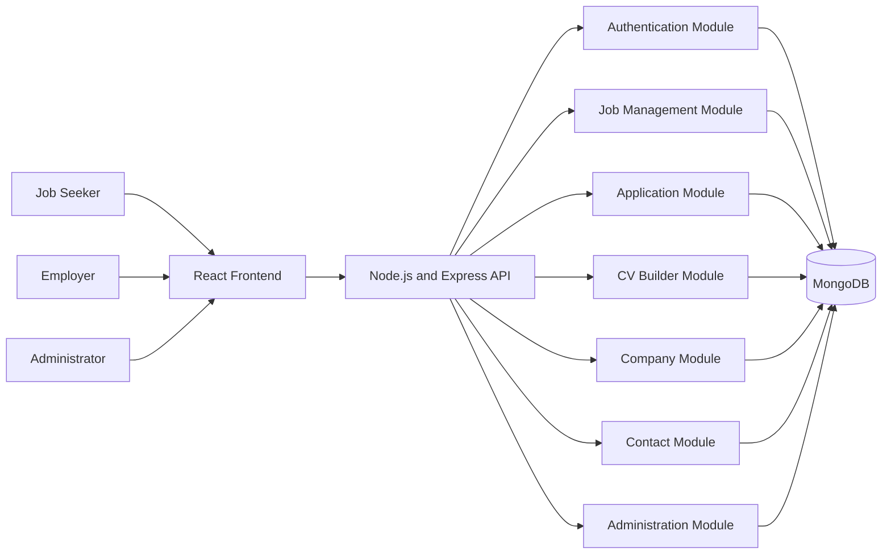

# NoGhostJob

NoGhostJob is a student-focused job platform that helps job seekers discover suitable opportunities, build professional CVs, apply for jobs, and receive useful feedback on rejected applications.

## Team

| Role | Name |
|---|---|
| Product Owner | Deval Mevada |
| Scrum Master | Tej Bahadur Shrestha |
| Developer | Meet Bhadehsia |
| Developer | Rohan Pandey |
| Developer | Dev Desai |

## Project Overview

NoGhostJob is designed primarily for students, international students, working students, graduates, and early-career job seekers.

The platform brings job searching, job applications, CV creation, and employer recruitment management into one system.

Job seekers can:

- Create and manage a personal profile
- Search for jobs using keywords, location, job type, and experience filters
- View detailed job information
- Save job opportunities
- Build a professional CV using multiple templates
- Save and update CV information
- Apply for jobs using a one-click application process
- Track submitted applications
- View application statuses
- Receive useful feedback when an application is rejected

Employers can:

- Create and manage a company profile
- Post new job vacancies
- Edit and manage existing job listings
- View applicants for specific jobs
- Review applicant profiles and CV information
- Update application statuses
- Provide rejection feedback to candidates
- Monitor recruitment activity through an employer dashboard

## Project Goals

The main goals of NoGhostJob are to:

1. Simplify the job-searching process for students.
2. Reduce repeated work during job applications.
3. Help candidates create professional CVs.
4. Improve communication between employers and applicants.
5. Provide constructive rejection feedback.
6. Help candidates understand which skills they should improve.
7. Give employers a structured way to manage jobs and applications.

## Main Features

### Job Seeker Features

- User registration and login
- Personal profile management
- Job search and filtering
- Job detail pages
- Featured job listings
- Company information
- One-click job applications
- Application history
- Application status tracking
- CV builder
- Multiple CV templates
- CV preview
- Saved CV data
- Rejection feedback

### Employer Features

- Employer registration and login
- Employer dashboard
- Company profile management
- Create job listings
- Edit job listings
- Delete or deactivate jobs
- View company job listings
- View applicants
- Review applicant information
- Review applicant CVs
- Update application status
- Provide feedback to rejected candidates
- Recruitment analytics overview

### Administration Features

- Manage platform members
- Manage job listings
- Manage users and employers
- Monitor platform data
- Maintain team information displayed on the About page

## User Roles

The system currently supports the following account types:

| Role | Description |
|---|---|
| Job Seeker | Searches for jobs, creates a CV, submits applications, and tracks application progress |
| Employer | Creates company information, posts jobs, and manages applicants |
| Administrator | Manages platform content, members, users, companies, and job information |

## Application Status Flow

An application can move through the following stages:

```text
Applied
   │
   ▼
Under Review
   │
   ▼
Shortlisted
   │
   ▼
Interview
   │
   ├──────────────► Offered / Hired
   │
   └──────────────► Rejected
```

The current dashboard may group active application statuses under **Applied**, while **Offered** and **Rejected** are shown separately.

## Architecture

NoGhostJob follows a MERN-stack client-server architecture.



### Architecture Components

| Component | Responsibility |
|---|---|
| React Frontend | Provides the user, employer, and administrator interfaces |
| Express API | Handles requests, validation, authentication, and application logic |
| MongoDB | Stores users, companies, jobs, applications, CVs, and platform content |
| JWT Authentication | Secures protected API routes |
| CV Builder | Creates and stores structured CV information and selected templates |
| Application Module | Handles one-click applications and application statuses |
| Employer Dashboard | Allows employers to manage jobs and applicants |

## Tech Stack

| Layer | Technology |
|---|---|
| Frontend | React, Vite, JavaScript, Tailwind CSS |
| Backend | Node.js, Express.js |
| Database | MongoDB with Mongoose |
| Authentication | JSON Web Tokens and bcrypt |
| HTTP Client | Axios and Fetch API |
| State Management | React Hooks and browser storage |
| CV Generation | HTML-based CV templates with optional PDF generation |
| Version Control | Git and GitHub |
| Development API | REST API |
| Deployment | To be configured |

## Database Collections

The project may contain the following MongoDB collections:

| Collection | Purpose |
|---|---|
| Users | Stores job-seeker and employer accounts |
| Companies | Stores employer company profiles |
| Jobs | Stores job listings |
| Applications | Stores submitted job applications |
| Categories | Stores job categories |
| Testimonials | Stores platform testimonials |
| Newsletters | Stores newsletter subscriptions |
| Members | Stores project or platform team members |

## Main Data Relationships

```text
User
 ├── Profile
 ├── CV
 └── Applications

Company
 ├── Employer
 └── Jobs

Job
 ├── Company
 └── Applications

Application
 ├── Applicant
 ├── Job
 ├── Job Snapshot
 ├── Applicant Snapshot
 ├── Status
 └── Employer Feedback
```

## API Overview

### Authentication and User Routes

```text
POST   /api/auth/register
POST   /api/auth/login
GET    /api/auth/profile
PUT    /api/auth/profile
POST   /api/auth/contact
POST   /api/auth/cv
GET    /api/auth/cv
```

### Job Routes

```text
GET    /api/jobs
GET    /api/jobs/:jobId
POST   /api/jobs
PUT    /api/jobs/:jobId
DELETE /api/jobs/:jobId
```

### Company Routes

```text
GET    /api/companies
GET    /api/companies/:companyId
GET    /api/companies/:companyId/jobs
POST   /api/companies
PUT    /api/companies/:companyId
```

### Application Routes

```text
GET    /api/applications/my-applications
GET    /api/applications/:jobId/:userId/status
POST   /api/applications/:jobId/:userId/apply
GET    /api/applications/job/:jobId
PATCH  /api/applications/:applicationId/status
```

### Administration Routes

```text
GET    /api/admin/members
POST   /api/admin/members
PUT    /api/admin/members/:memberId
DELETE /api/admin/members/:memberId
```

The exact routes may vary depending on the latest backend configuration.

## Getting Started

### Prerequisites

Install the following software before running the project:

- Node.js
- npm
- MongoDB
- Git
- Docker and Docker Compose, if the Docker setup is being used

## Clone the Repository

```bash
git clone https://github.com/<your-username>/<your-repository>.git
cd <your-repository>
```

Replace the placeholder repository URL with the actual NoGhostJob repository URL.

## Environment Variables

Create a `.env` file inside the backend directory:

```env
PORT=5000
MONGO_URI=will_be_provided_on_a_request
JWT_SECRET=replace_with_a_secure_secret
```

Create a `.env` file inside the frontend directory:

```env
VITE_API_URL=http://localhost:5000/api
```

Do not commit real secrets to GitHub.

## Install Dependencies

### Backend

```bash
cd backend
npm install
```

### Frontend

Open another terminal:

```bash
cd frontend
npm install
```

## Run the Project Locally

### Start MongoDB

Ensure that the MongoDB service is running locally.

### Start the Backend

```bash
cd backend
npm run dev
```

If no development command is configured, use:

```bash
npm start
```

The backend should be available at:

```text
http://localhost:5000
```

### Start the Frontend

```bash
cd frontend
npm run dev
```

The frontend will normally be available at:

```text
http://localhost:5173
```

## Running with Docker

When a complete Docker configuration is available, run:

```bash
cp .env.example .env
docker compose up --build
```

The Docker configuration should include:

- Frontend service
- Backend service
- MongoDB service
- Required environment variables
- Persistent MongoDB volume

## Repository Structure

```text
NoGhostJob/
├── README.md
├── .gitignore
├── docker-compose.yml
│
├── frontend/
│   ├── public/
│   ├── src/
│   │   ├── Components/
│   │   │   ├── User/
│   │   │   ├── Employer/
│   │   │   └── Common/
│   │   │
│   │   ├── Pages/
│   │   │   ├── User/
│   │   │   ├── Employer/
│   │   │   ├── Jobs/
│   │   │   ├── Company/
│   │   │   ├── CVBuilder/
│   │   │   ├── About/
│   │   │   └── Contact/
│   │   │
│   │   ├── services/
│   │   │   └── api.js
│   │   │
│   │   ├── App.jsx
│   │   └── main.jsx
│   │
│   ├── package.json
│   └── vite.config.js
│
├── backend/
│   ├── config/
│   │   └── db.js
│   │
│   ├── Controller/
│   │   ├── authController.js
│   │   ├── jobController.js
│   │   ├── companyController.js
│   │   ├── applicationController.js
│   │   └── adminController.js
│   │
│   ├── middleware/
│   │   └── authMiddleware.js
│   │
│   ├── models/
│   │   ├── user.js
│   │   ├── Job.js
│   │   ├── Company.js
│   │   ├── Application.js
│   │   ├── Category.js
│   │   ├── Testimonial.js
│   │   └── Member.js
│   │
│   ├── routes/
│   │   ├── authRoutes.js
│   │   ├── jobRoutes.js
│   │   ├── companyRoutes.js
│   │   ├── applicationRoutes.js
│   │   └── adminRoutes.js
│   │
│   ├── server.js
│   ├── package.json
│   └── .env
│
└── docs/
    ├── vision.md
    ├── architecture.md
    ├── user-stories.md
    └── api-documentation.md
```

Update the structure above to match the exact folder and file names used in the repository.

## Documentation

Project documentation can be stored in the `docs` directory.

- [Product Vision](docs/vision.md)

- [User Stories](docs/user-stories.md)


## Product Vision

NoGhostJob aims to create a more useful and transparent recruitment experience for students and early-career job seekers.

Rather than only notifying candidates that they were rejected, the platform is intended to provide structured feedback that helps candidates understand:

- Why their application was unsuccessful
- Which required skills were missing
- Which parts of their CV could be improved
- What experience employers expected
- How they can better prepare for future opportunities

## Future Improvements

Planned improvements may include:

- AI-assisted CV recommendations
- CV-to-job matching
- Skills-gap analysis
- Personalised job recommendations
- Email notifications
- Interview scheduling
- Employer feedback templates
- Application analytics
- Cloud-based CV PDF storage
- Real-time notifications
- Advanced employer analytics
- Admin moderation tools
- Mobile-responsive enhancements
- Production deployment
- Automated testing
- Continuous integration and deployment

## Security Considerations

The application should follow these security practices:

- Hash passwords using bcrypt
- Protect private routes using JWT authentication
- Validate all request data
- Keep secrets in environment variables
- Restrict access based on account type
- Prevent users from accessing other users' applications
- Prevent employers from accessing unrelated applicants
- Avoid exposing passwords or sensitive data in API responses
- Configure CORS for approved frontend domains
- Add request-rate limiting in production
- Use HTTPS in production

## Contribution Workflow

1. Create a new branch from the development branch.

```bash
git checkout -b feature/feature-name
```

2. Make and test the required changes.

3. Commit the changes.

```bash
git add .
git commit -m "Add feature description"
```

4. Push the branch.

```bash
git push origin feature/feature-name
```

5. Open a pull request for review.

## Branching Example

```text
main
└── development
    ├── feature/job-search
    ├── feature/cv-builder
    ├── feature/employer-dashboard
    └── fix/application-status
```

## License

This project is licensed under the MIT License.

## Project Status

NoGhostJob is currently under active development. Features, API routes, data models, and folder structures may change as the project evolves.